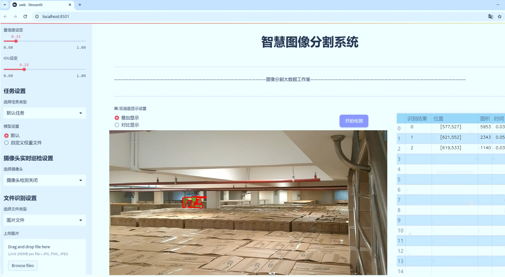
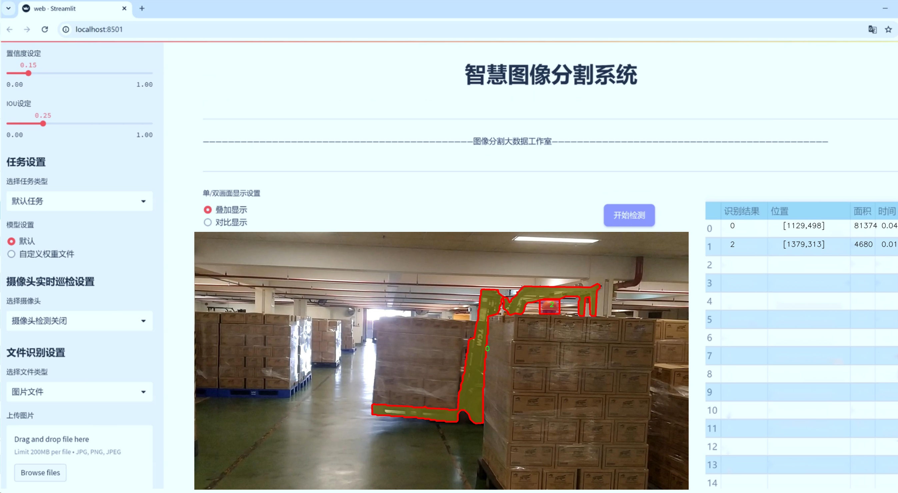
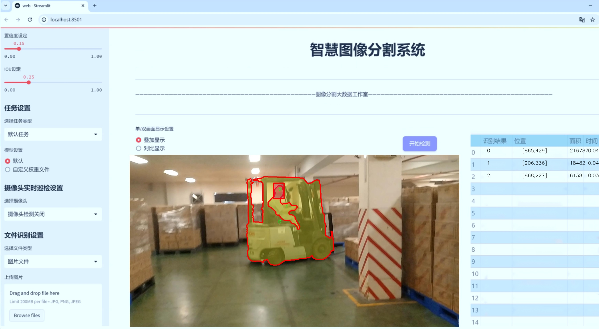
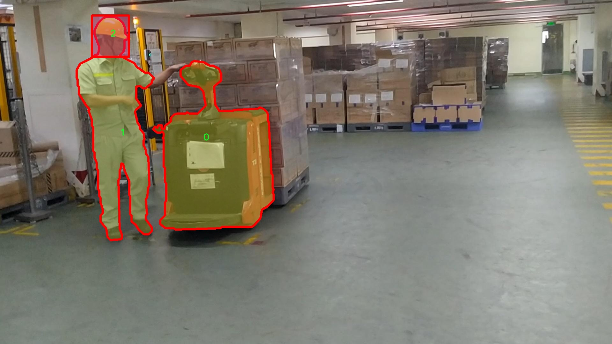
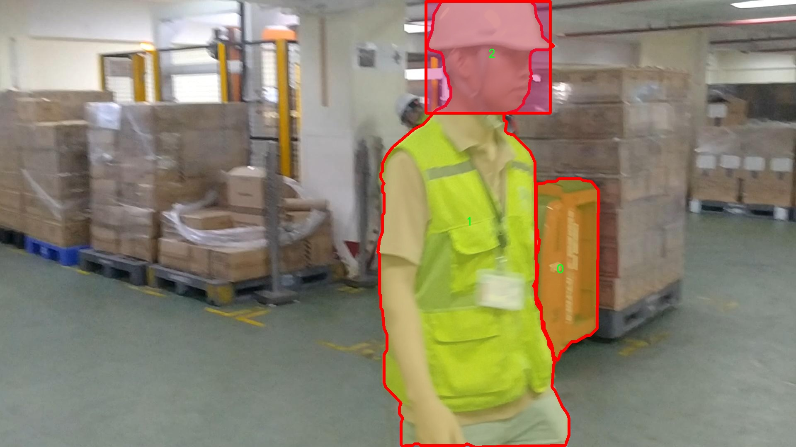
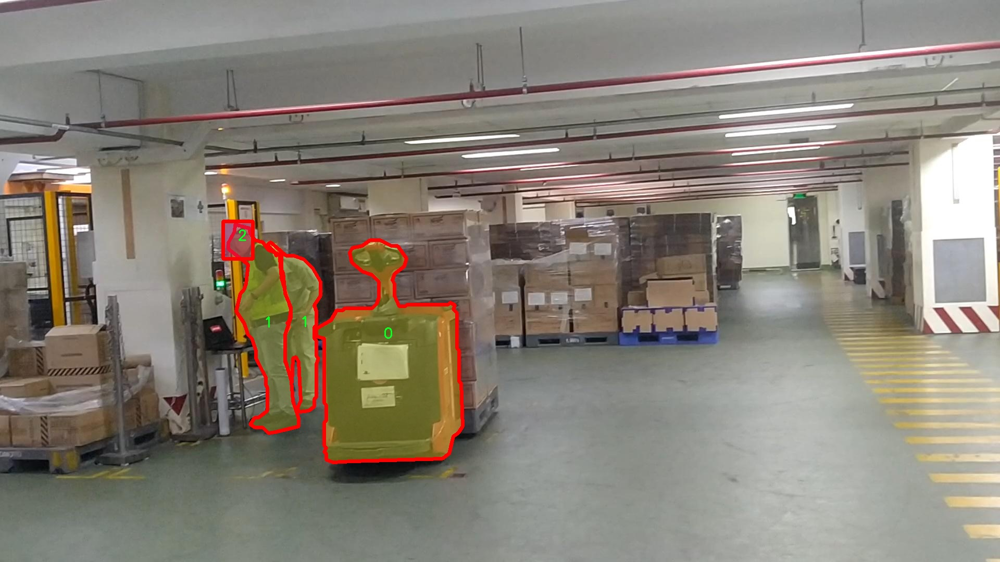
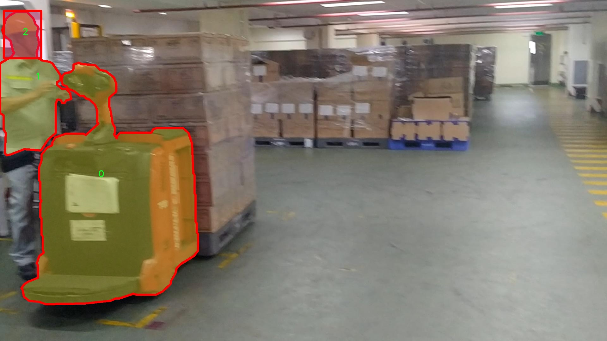
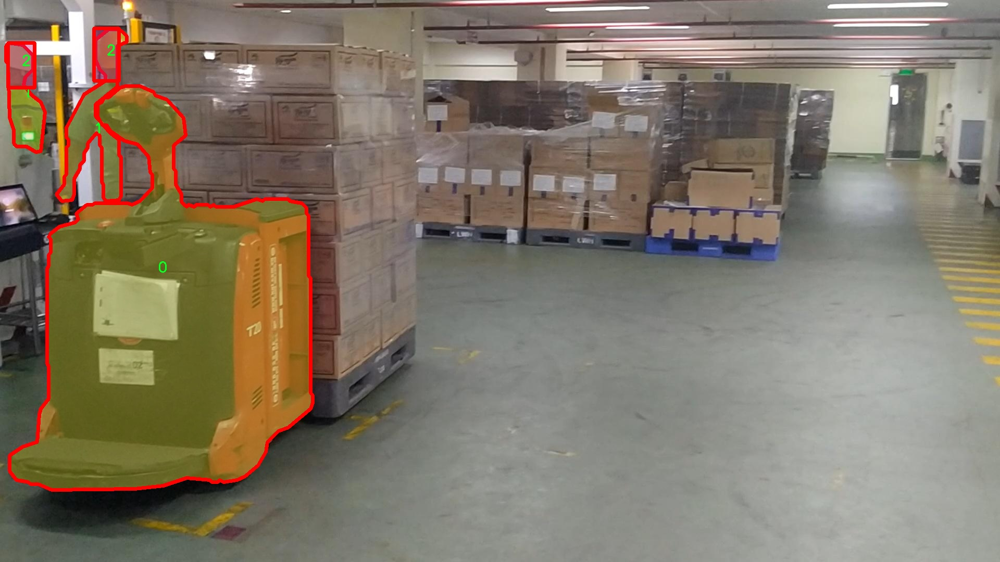

# 叉车图像分割系统： yolov8-seg-rtdetr

### 1.研究背景与意义

[参考博客](https://gitee.com/YOLOv8_YOLOv11_Segmentation_Studio/projects)

[博客来源](https://kdocs.cn/l/cszuIiCKVNis)

研究背景与意义

随着工业自动化的快速发展，叉车作为现代物流和仓储管理中不可或缺的设备，其应用范围不断扩大。叉车在搬运、堆垛和分拣等环节中发挥着重要作用，因此对叉车的智能识别与监控技术的需求日益增加。传统的叉车识别方法多依赖于人工操作或简单的图像处理技术，效率低下且易受环境因素的影响，难以满足现代智能仓储的需求。因此，开发一种高效、准确的叉车图像分割系统显得尤为重要。

在这一背景下，基于深度学习的目标检测与图像分割技术逐渐成为研究热点。YOLO（You Only Look Once）系列模型因其高效的实时性和较强的检测能力，已被广泛应用于各类目标检测任务。YOLOv8作为该系列的最新版本，结合了多种先进的技术，具有更高的准确性和更快的推理速度。然而，针对叉车图像分割的特定需求，YOLOv8仍存在一些改进空间，尤其是在处理复杂背景、遮挡情况以及多叉车同时出现的场景时。因此，基于改进YOLOv8的叉车图像分割系统的研究具有重要的现实意义。

本研究将使用包含1300张图像的叉车图像分割数据集，该数据集涵盖了三类叉车目标，具体为类别0、1和2。这些图像不仅包括叉车的不同视角和状态，还涉及多种复杂的背景环境，如仓库、工厂和户外场景。这为模型的训练和测试提供了丰富的样本，有助于提高模型的泛化能力和鲁棒性。通过对这些图像进行实例分割，能够精确地识别出叉车的轮廓和位置，从而为后续的自动化操作提供基础数据支持。

此外，叉车图像分割系统的研究还具有广泛的应用前景。通过实现对叉车的精准识别与定位，可以为智能仓储系统提供实时监控和管理解决方案，提升物流效率，降低人工成本。同时，该系统也可以与其他智能设备进行联动，形成完整的智能物流生态系统。例如，在自动驾驶叉车的应用中，图像分割技术可以帮助其更好地理解周围环境，从而实现安全、高效的自主作业。

综上所述，基于改进YOLOv8的叉车图像分割系统的研究，不仅能够推动深度学习技术在工业领域的应用，还将为叉车的智能化管理提供重要的技术支持。通过深入探讨该系统的设计与实现，期望能够为未来的智能物流发展贡献新的思路与方法，推动工业自动化的进一步发展。

### 2.图片演示







注意：本项目提供完整的训练源码数据集和训练教程,由于此博客编辑较早,暂不提供权重文件（best.pt）,需要按照6.训练教程进行训练后实现上图效果。

### 3.视频演示

[3.1 视频演示](https://www.bilibili.com/video/BV1Hbm2Y4EpH/)

### 4.数据集信息

##### 4.1 数据集类别数＆类别名

nc: 3
names: ['0', '1', '2']


##### 4.2 数据集信息简介

数据集信息展示

在现代计算机视觉领域，图像分割技术的进步为自动化和智能化应用提供了强有力的支持。为此，本研究所采用的数据集“forklift2_seg”专门用于训练和改进YOLOv8-seg叉车图像分割系统，旨在提升叉车识别与分割的准确性和效率。该数据集包含了多样化的叉车图像，涵盖了不同环境、角度和光照条件下的叉车样本，确保了模型在实际应用中的鲁棒性。

“forklift2_seg”数据集的类别数量为3，分别用数字“0”、“1”和“2”进行标识。这些类别的设计考虑到了叉车在不同场景中的多样性，具体来说，类别“0”可能代表某种特定类型的叉车，例如电动叉车，而类别“1”则可能对应于内燃叉车，类别“2”则可以是叉车的配件或其他相关设备。这样的分类不仅有助于模型在训练过程中学习到叉车的基本特征，还能使其在面对复杂场景时具备更强的辨识能力。

数据集中的图像经过精心挑选和标注，确保每个类别的样本都具备代表性和多样性。标注过程采用了先进的图像标注工具，确保每个叉车的轮廓和关键特征都被准确地勾勒出来。这样的高质量标注为YOLOv8-seg模型的训练提供了坚实的基础，使其能够在分割任务中实现更高的精度。此外，数据集中还包含了不同背景和环境的图像，以模拟叉车在实际工作中的多种应用场景，进一步增强模型的泛化能力。

在数据集的构建过程中，考虑到了图像的多样性和复杂性，确保模型在面对不同类型叉车时能够有效地进行分割。这种多样性不仅体现在叉车的外观上，还包括叉车与周围环境的互动，例如叉车在仓库、工厂、建筑工地等不同场景中的表现。通过这种方式，研究团队希望模型能够学习到叉车在各种环境下的特征，从而在实际应用中表现出色。

为了确保数据集的有效性和实用性，研究团队还进行了数据增强处理，包括旋转、缩放、翻转和亮度调整等。这些增强手段旨在增加数据集的样本数量和多样性，使得模型在训练过程中能够接触到更多的变异情况，从而提高其鲁棒性和适应性。经过这些处理后的数据集，不仅提升了模型的训练效果，也为后续的验证和测试提供了更为全面的样本支持。

总之，“forklift2_seg”数据集的构建充分考虑了叉车图像分割任务的实际需求，通过精心的样本选择和标注、丰富的类别设计以及有效的数据增强手段，为YOLOv8-seg模型的训练提供了坚实的基础。随着数据集的应用，研究团队期待能够在叉车图像分割领域取得突破性进展，为相关行业的自动化和智能化发展贡献力量。











### 5.项目依赖环境部署教程（零基础手把手教学）

[5.1 环境部署教程链接（零基础手把手教学）](https://www.bilibili.com/video/BV1jG4Ve4E9t/?vd_source=bc9aec86d164b67a7004b996143742dc)


[5.2 安装Python虚拟环境创建和依赖库安装视频教程链接（零基础手把手教学）](https://www.bilibili.com/video/BV1nA4VeYEze/?vd_source=bc9aec86d164b67a7004b996143742dc)

### 6.手把手YOLOV8-seg训练视频教程（零基础手把手教学）

[6.1 手把手YOLOV8-seg训练视频教程（零基础小白有手就能学会）](https://www.bilibili.com/video/BV1cA4VeYETe/?vd_source=bc9aec86d164b67a7004b996143742dc)


按照上面的训练视频教程链接加载项目提供的数据集，运行train.py即可开始训练



     Epoch   gpu_mem       box       obj       cls    labels  img_size
     1/200     0G   0.01576   0.01955  0.007536        22      1280: 100%|██████████| 849/849 [14:42<00:00,  1.04s/it]
               Class     Images     Labels          P          R     mAP@.5 mAP@.5:.95: 100%|██████████| 213/213 [01:14<00:00,  2.87it/s]
                 all       3395      17314      0.994      0.957      0.0957      0.0843

     Epoch   gpu_mem       box       obj       cls    labels  img_size
     2/200     0G   0.01578   0.01923  0.007006        22      1280: 100%|██████████| 849/849 [14:44<00:00,  1.04s/it]
               Class     Images     Labels          P          R     mAP@.5 mAP@.5:.95: 100%|██████████| 213/213 [01:12<00:00,  2.95it/s]
                 all       3395      17314      0.996      0.956      0.0957      0.0845

     Epoch   gpu_mem       box       obj       cls    labels  img_size
     3/200     0G   0.01561    0.0191  0.006895        27      1280: 100%|██████████| 849/849 [10:56<00:00,  1.29it/s]
               Class     Images     Labels          P          R     mAP@.5 mAP@.5:.95: 100%|███████   | 187/213 [00:52<00:00,  4.04it/s]
                 all       3395      17314      0.996      0.957      0.0957      0.0845


### 7.50+种全套YOLOV8-seg创新点加载调参实验视频教程（一键加载写好的改进模型的配置文件）

[7.1 50+种全套YOLOV8-seg创新点加载调参实验视频教程（一键加载写好的改进模型的配置文件）](https://www.bilibili.com/video/BV1Hw4VePEXv/?vd_source=bc9aec86d164b67a7004b996143742dc)

### YOLOV8-seg算法简介

原始YOLOv8-seg算法原理

YOLOv8-seg算法是YOLO系列目标检测模型的最新版本，它在YOLOv5的基础上进行了深度优化和创新，旨在提高目标检测的精度和速度，同时增强模型的灵活性和适应性。YOLOv8-seg不仅支持传统的目标检测任务，还引入了分割功能，使其在处理复杂场景时能够提供更为细致的物体边界信息。该算法的设计理念是将高效性与准确性结合，确保在实时应用中也能达到较高的性能。

YOLOv8-seg的网络结构主要由三个部分组成：Backbone（骨干网络）、Neck（颈部结构）和Head（头部结构）。在Backbone部分，YOLOv8-seg采用了轻量化的C2F模块来替代传统的C3模块。C2F模块的设计理念是通过引入更多的跳层连接，增强梯度流动，从而提高特征提取的效率和效果。相较于C3模块，C2F模块在减少计算量的同时，能够提取更丰富的特征信息，确保模型在轻量化的同时不牺牲性能。

在Neck部分，YOLOv8-seg结合了特征金字塔网络（FPN）和路径聚合网络（PAN），以实现多尺度特征的有效融合。FPN的设计使得模型能够在不同的尺度上提取特征，而PAN则通过优化特征的传递路径，进一步增强了模型对不同尺度特征的捕捉能力。为了进一步提升特征融合的效率，YOLOv8-seg引入了BiFPN网络。BiFPN通过高效的双向跨尺度连接和加权特征融合，显著提高了特征提取的速度和准确性。

在Head部分，YOLOv8-seg采用了解耦头的设计理念，将目标检测任务中的分类和定位分开处理。具体而言，模型通过两个并行的分支分别提取类别特征和位置特征。这种解耦的方式使得模型在处理分类和定位任务时能够更好地聚焦于各自的特征，从而提高了模型的收敛速度和预测精度。此外，YOLOv8-seg还引入了无锚框结构，直接预测目标的中心位置，并通过任务对齐学习（TAL）来优化正负样本的区分。TAL的引入使得模型在分类和定位的损失函数中都考虑了任务对齐的程度，从而实现了更高的准确性。

YOLOv8-seg在训练过程中采用了一系列创新的数据增强技术。虽然Mosaic数据增强在一定程度上提高了模型的鲁棒性，但YOLOv8-seg在训练的最后阶段停止使用该方法，以避免对数据真实分布的破坏。这一策略确保了模型在训练过程中能够学习到更为真实和有效的特征信息，从而提升了最终的检测性能。

在实际应用中，YOLOv8-seg表现出了优越的性能。通过在COCO数据集上的测试，YOLOv8-seg在多个指标上均优于之前的YOLO系列模型，尤其是在mAP（mean Average Precision）和推理速度方面。模型的轻量化设计使其能够在资源受限的环境中运行，适用于实时目标检测和分割任务。这一特性使得YOLOv8-seg在诸如智能监控、自动驾驶、机器人视觉等领域具有广泛的应用前景。

综上所述，YOLOv8-seg算法通过一系列创新的设计和优化，不仅提高了目标检测的精度和速度，还增强了模型的灵活性和适应性。其轻量化的结构和高效的特征提取能力，使得YOLOv8-seg成为当前目标检测和分割任务中的一种强大工具。随着对该算法的深入研究和应用，未来有望在更多复杂场景中发挥重要作用。


### 9.系统功能展示（检测对象为举例，实际内容以本项目数据集为准）

图9.1.系统支持检测结果表格显示

  图9.2.系统支持置信度和IOU阈值手动调节

  图9.3.系统支持自定义加载权重文件best.pt(需要你通过步骤5中训练获得)

  图9.4.系统支持摄像头实时识别

  图9.5.系统支持图片识别

  图9.6.系统支持视频识别

  图9.7.系统支持识别结果文件自动保存

  图9.8.系统支持Excel导出检测结果数据


### 10.50+种全套YOLOV8-seg创新点原理讲解（非科班也可以轻松写刊发刊，V11版本正在科研待更新）

#### 10.1 由于篇幅限制，每个创新点的具体原理讲解就不一一展开，具体见下列网址中的创新点对应子项目的技术原理博客网址【Blog】：


[10.1 50+种全套YOLOV8-seg创新点原理讲解链接](https://gitee.com/qunmasj/good)

#### 10.2 部分改进模块原理讲解(完整的改进原理见上图和技术博客链接)【如果此小节的图加载失败可以通过CSDN或者Github搜索该博客的标题访问原始博客，原始博客图片显示正常】
### 可变性卷积DCN简介
卷积神经网络由于其构建模块中固定的几何结构，本质上受限于模型几何变换。为了提高卷积神经网络的转换建模能力，《Deformable Convolutional Networks》作者提出了两个模块：可变形卷积（deformable convolution）和可变形RoI池（deformable RoI pooling）。这两个模块均基于用额外的偏移来增加模块中的空间采样位置以及从目标任务中学习偏移的思想，而不需要额外的监督。

第一次证明了在深度神经网络中学习密集空间变换（dense spatial transformation）对于复杂的视觉任务是有效的

视觉识别中的一个关键挑战是如何适应对象比例、姿态、视点和零件变形中的几何变化或模型几何变换。一般有两种方法实现：
1）建立具有足够期望变化的训练数据集。这通常通过增加现有的数据样本来实现，例如通过仿射变换。但是训练成本昂贵而且模型参数庞大。
2）使用变换不变（transformation-invariant）的特征和算法。比如比较有名的SIFT(尺度不变特征变换)便是这一类的代表算法。

但以上的方法有两个缺点：
1）几何变换被假定为固定的和已知的，这些先验知识被用来扩充数据，设计特征和算法。为此，这个假设阻止了对具有未知几何变换的新任务的推广，从而导致这些几何变换可能没有被正确建模。
2）对于不变特征和算法进行手动设计，对于过于复杂的变换可能是困难的或不可行的。

卷积神经网络本质上局限于模拟大型未知转换。局限性源于CNN模块的固定几何结构：卷积单元在固定位置对输入特征图进行采样；池化层以固定比率降低特征矩阵分辨率；RoI（感兴趣区域）池化层将RoI分成固定的空间箱（spatial bins）等。缺乏处理几何变换的内部机制。

这种内部机制的缺乏会导致一些问题，举个例子。同一个CNN层中所有激活单元的感受野大小是相同的，但是这是不可取的。因为不同的位置可能对应于具有不同尺度或变形的对象，所以尺度或感受野大小的自适应确定对于具有精细定位的视觉识别是渴望的。

对于这些问题，作者提出了两个模块提高CNNs对几何变换建模的能力。


deformable convolution（可变形卷积）
将2D偏移量添加到标准卷积中的常规网格采样位置，使得采样网格能够自由变形。通过额外的卷积层，从前面的特征映射中学习偏移。因此，变形采用局部、密集和自适应的方式取决于输入特征。


deformable RoI pooling（可变形RoI池化）
为先前RoI池化的常规库（bin）分区中的每个库位置（bin partition）增加了一个偏移量。类似地，偏移是从前面的特征图和感兴趣区域中学习的，从而能够对具有不同形状的对象进行自适应部件定位（adaptive part localization）。

#### Deformable Convolutional Networks
Deformable Convolution
2D卷积由两个步骤组成：
1）在输入特征图x xx上使用规则网格R RR进行采样。
2）把这些采样点乘不同权重w ww后相加。

网格R定义感受野大小和扩张程度，比如内核大小为3x3，扩张程度为1的网格R可以表示为：
R = { ( − 1 , − 1 ) , ( − 1 , 0 ) , … , ( 0 , 1 ) , ( 1 , 1 ) } R = \{(-1,-1),(-1,0),\dots,(0,1),(1,1)\}
R={(−1,−1),(−1,0),…,(0,1),(1,1)}

​
 一般为小数，使用双线性插值进行处理。（把小数坐标分解到相邻的四个整数坐标点来计算结果）


具体操作如图所示：


首先对输入特征层进行一个普通的3x3卷积处理得到偏移域（offset field）。偏移域特征图具有与输入特征图相同的空间分辨率，channels维度2N对应于N个2D（xy两个方向）偏移。其中的N是原输入特征图上所具有的N个channels，也就是输入输出channels保持不变，这里xy两个channels分别对输出特征图上的一个channels进行偏移。确定采样点后就通过与相对应的权重w点乘相加得到输出特征图上该点最终值。

前面也提到过，由于这里xy两个方向所训练出来的偏移量一般来说是一个小数，那么为了得到这个点所对应的数值，会采用双线性插值的方法，从最近的四个邻近坐标点中计算得到该偏移点的数值，公式如下：


具体推理过程见：双线性插值原理

#### Deformable RoI Poolingb
所有基于区域提议（RPN）的对象检测方法都使用RoI池话处理，将任意大小的输入矩形区域转换为固定大小的特征图。


 一般为小数，需要使用双线性插值进行处理。


具体操作如图所示：


当时看这个部分的时候觉得有些突兀，明明RoI池化会将特征层转化为固定尺寸的区域。其实，我个人觉得，这个部分与上述的可变性卷积操作是类似的。这里同样是使用了一个普通的RoI池化操作，进行一些列处理后得到了一个偏移域特征图，然后重新作用于原来的w × H w \times Hw×H的RoI。只不过这里不再是规律的逐行逐列对每个格子进行池化，而是对于格子进行偏移后再池化处理。

#### Postion﹣Sensitive RoI Pooling
除此之外，论文还提出一种PS RoI池化（Postion﹣Sensitive RoI Pooling）。不同于上述可变形RoI池化中的全连接过程，这里使用全卷积替换。

具体操作如图所示：


首先，对于原来的特征图来说，原本是将输入特征图上的RoI区域分成k × k k\times kk×k个bin。而在这里，则是将输入特征图进行卷积操作，分别得到一个channels为k 2 ( C + 1 ) k^{2}(C+1)k (C+1)的得分图（score maps）和一个channels为2 k 2 ( C + 1 ) 2k{2}(C+1)2k 2 (C+1)的偏移域（offset fields），这两个特征矩阵的宽高是与输入特征矩阵相同的。其中，得分图的channels中，k × k k \times kk×k分别表示的是每一个网格，C CC表示的检测对象的类别数目，1表示背景。而在偏移域中的2表示xy两个方向的偏移。
也就是说，在PS RoI池化中，对于RoI的每一个网格都独自占一个通道形成一层得分图，然后其对于的偏移量占两个通道。offset fields得到的偏移是归一化后的偏移，需要通过和deformable RoI pooling中一样的变换方式得到∆ p i j ∆p_{ij}∆p ij，然后对每层得分图进行偏移池化处理。最后处理完的结果就对应着最后输出的一个网格。所以其包含了位置信息。

原文论述为：


#### Understanding Deformable ConvNets
当可变形卷积叠加时，复合变形的效果是深远的。如图所示：


ps：a是标准卷积的固定感受野，b是可变形卷积的适应性感受野。

感受野和标准卷积中的采样位置在整个顶部特征图上是固定的(左)。在可变形卷积中，它们根据对象的比例和形状进行自适应调整(右)。


### 11.项目核心源码讲解（再也不用担心看不懂代码逻辑）

#### 11.1 ultralytics\nn\extra_modules\afpn.py

以下是经过简化和注释的核心代码，主要保留了重要的类和方法，并对其进行了详细的中文注释。

```python
import torch
import torch.nn as nn
import torch.nn.functional as F
from ..modules.conv import Conv

# 定义基本的卷积块
class BasicBlock(nn.Module):
    def __init__(self, filter_in, filter_out):
        super(BasicBlock, self).__init__()
        # 定义两个卷积层
        self.conv1 = Conv(filter_in, filter_out, 3)  # 第一个卷积层
        self.conv2 = Conv(filter_out, filter_out, 3, act=False)  # 第二个卷积层，不使用激活函数

    def forward(self, x):
        residual = x  # 保存输入以便后续残差连接
        out = self.conv1(x)  # 通过第一个卷积层
        out = self.conv2(out)  # 通过第二个卷积层
        out += residual  # 添加残差
        return self.conv1.act(out)  # 返回经过激活函数处理的输出


# 定义上采样模块
class Upsample(nn.Module):
    def __init__(self, in_channels, out_channels, scale_factor=2):
        super(Upsample, self).__init__()
        # 定义上采样操作
        self.upsample = nn.Sequential(
            Conv(in_channels, out_channels, 1),  # 1x1卷积
            nn.Upsample(scale_factor=scale_factor, mode='bilinear')  # 双线性插值上采样
        )

    def forward(self, x):
        return self.upsample(x)  # 直接返回上采样结果


# 定义自适应特征融合模块（ASFF）
class ASFF(nn.Module):
    def __init__(self, num_levels, inter_dim=512):
        super(ASFF, self).__init__()
        self.inter_dim = inter_dim
        compress_c = 8  # 压缩通道数

        # 定义每个输入层的权重卷积
        self.weight_layers = nn.ModuleList([Conv(inter_dim, compress_c, 1) for _ in range(num_levels)])
        self.weight_levels = nn.Conv2d(compress_c * num_levels, num_levels, kernel_size=1)  # 权重层
        self.conv = Conv(inter_dim, inter_dim, 3)  # 最后的卷积层

    def forward(self, *inputs):
        # 计算每个输入的权重
        weights = [layer(input) for layer, input in zip(self.weight_layers, inputs)]
        levels_weight_v = torch.cat(weights, dim=1)  # 连接所有权重
        levels_weight = self.weight_levels(levels_weight_v)  # 计算最终权重
        levels_weight = F.softmax(levels_weight, dim=1)  # 归一化权重

        # 进行加权融合
        fused_out_reduced = sum(input * levels_weight[:, i:i+1, :, :] for i, input in enumerate(inputs))
        return self.conv(fused_out_reduced)  # 返回融合后的结果


# 定义主网络结构
class AFPN(nn.Module):
    def __init__(self, in_channels, out_channels, factor=4):
        super(AFPN, self).__init__()
        # 定义输入通道的卷积层
        self.convs = nn.ModuleList([Conv(in_channel, in_channel // factor, 1) for in_channel in in_channels])
        self.body = BlockBody_P345([in_channel // factor for in_channel in in_channels])  # 主要处理体
        # 定义输出通道的卷积层
        self.output_convs = nn.ModuleList([Conv(in_channel // factor, out_channels, 1) for in_channel in in_channels])

    def forward(self, x):
        # 对输入进行卷积处理
        x = [conv(input) for conv, input in zip(self.convs, x)]
        out = self.body(x)  # 通过主处理体
        # 通过输出卷积层
        return [output_conv(output) for output_conv, output in zip(self.output_convs, out)]


# 定义自定义的AFPN网络
class AFPN_Custom(AFPN):
    def __init__(self, in_channels, out_channels, block_type='C2f', factor=4):
        super().__init__(in_channels, out_channels, factor)
        self.body = BlockBody_P345_Custom([in_channel // factor for in_channel in in_channels], block_type)  # 使用自定义块

```

### 代码说明：
1. **BasicBlock**: 这是一个基本的卷积块，包含两个卷积层和一个残差连接。
2. **Upsample**: 这是一个上采样模块，使用1x1卷积和双线性插值进行上采样。
3. **ASFF**: 自适应特征融合模块，能够根据输入特征的权重进行加权融合。
4. **AFPN**: 主网络结构，负责将输入特征进行卷积处理，并通过BlockBody进行特征融合和处理。
5. **AFPN_Custom**: 自定义的AFPN网络，允许使用不同类型的块。

以上代码为核心功能模块，便于理解和扩展。

该文件定义了一些用于特征金字塔网络（FPN）的模块，主要用于计算机视觉任务中的特征提取和融合。代码使用了PyTorch框架，以下是对各个部分的详细说明。

首先，文件导入了一些必要的库和模块，包括`OrderedDict`、`torch`、`torch.nn`和一些自定义的卷积和块模块。接着，定义了一些类，这些类主要用于构建特征金字塔网络的各个组件。

`BasicBlock`类是一个基本的残差块，包含两个卷积层。它的前向传播方法中，输入经过两个卷积层处理后，与输入相加，形成残差连接，最后通过激活函数输出。

`Upsample`类实现了上采样操作，使用卷积层和双线性插值来增加特征图的尺寸。`Downsample_x2`、`Downsample_x4`和`Downsample_x8`类则分别实现了不同倍数的下采样，使用卷积层进行特征图的尺寸缩小。

`ASFF_2`、`ASFF_3`和`ASFF_4`类实现了自适应特征融合模块（ASFF），用于融合不同尺度的特征图。每个类的构造函数中定义了用于计算权重的卷积层，前向传播方法中通过计算输入特征图的权重，融合多个输入特征图并输出。

`BlockBody_P345`和`BlockBody_P2345`类是特征金字塔网络的主体部分，分别处理三个和四个尺度的特征图。它们的构造函数中定义了多个卷积层、下采样和上采样模块，以及自适应特征融合模块。前向传播方法中，输入的特征图经过多个处理步骤，包括卷积、下采样、上采样和特征融合，最终输出多个尺度的特征图。

`AFPN_P345`和`AFPN_P2345`类是特征金字塔网络的最终实现，分别对应于处理三个和四个输入通道的特征图。它们的构造函数中定义了输入通道的卷积层、主体部分以及输出通道的卷积层。在前向传播方法中，输入特征图经过卷积处理后传递给主体部分，最后输出经过处理的特征图。

`BlockBody_P345_Custom`、`BlockBody_P2345_Custom`、`AFPN_P345_Custom`和`AFPN_P2345_Custom`类是对前面类的扩展，允许用户自定义块类型，以便在构建特征金字塔网络时使用不同的模块。

整体来看，这个文件实现了一个灵活的特征金字塔网络结构，能够根据输入特征图的不同尺度进行有效的特征提取和融合，适用于各种计算机视觉任务，如目标检测和图像分割等。

#### 11.2 ultralytics\models\rtdetr\train.py

以下是经过简化和注释的核心代码部分：

```python
# 导入必要的库
from copy import copy
import torch
from ultralytics.models.yolo.detect import DetectionTrainer
from ultralytics.nn.tasks import RTDETRDetectionModel
from ultralytics.utils import RANK, colorstr
from .val import RTDETRDataset, RTDETRValidator

class RTDETRTrainer(DetectionTrainer):
    """
    RT-DETR模型的训练类，继承自YOLO的DetectionTrainer类。
    该模型由百度开发，旨在实现实时目标检测，利用视觉变换器（Vision Transformers）和其他特性。
    """

    def get_model(self, cfg=None, weights=None, verbose=True):
        """
        初始化并返回一个用于目标检测的RT-DETR模型。

        参数:
            cfg (dict, optional): 模型配置，默认为None。
            weights (str, optional): 预训练模型权重的路径，默认为None。
            verbose (bool): 是否详细日志记录，默认为True。

        返回:
            (RTDETRDetectionModel): 初始化后的模型。
        """
        # 创建RT-DETR检测模型
        model = RTDETRDetectionModel(cfg, nc=self.data['nc'], verbose=verbose and RANK == -1)
        if weights:
            model.load(weights)  # 加载预训练权重
        return model

    def build_dataset(self, img_path, mode='val', batch=None):
        """
        构建并返回用于训练或验证的RT-DETR数据集。

        参数:
            img_path (str): 包含图像的文件夹路径。
            mode (str): 数据集模式，'train'或'val'。
            batch (int, optional): 矩形训练的批量大小，默认为None。

        返回:
            (RTDETRDataset): 针对特定模式的数据集对象。
        """
        # 创建RT-DETR数据集
        return RTDETRDataset(img_path=img_path,
                             imgsz=self.args.imgsz,
                             batch_size=batch,
                             augment=mode == 'train',  # 训练模式下进行数据增强
                             hyp=self.args,
                             rect=False,
                             cache=self.args.cache or None,
                             prefix=colorstr(f'{mode}: '),  # 设置前缀以便于日志记录
                             data=self.data)

    def get_validator(self):
        """
        返回适合RT-DETR模型验证的检测验证器。

        返回:
            (RTDETRValidator): 用于模型验证的验证器对象。
        """
        self.loss_names = 'giou_loss', 'cls_loss', 'l1_loss'  # 定义损失名称
        return RTDETRValidator(self.test_loader, save_dir=self.save_dir, args=copy(self.args))

    def preprocess_batch(self, batch):
        """
        预处理一批图像，将图像缩放并转换为浮点格式。

        参数:
            batch (dict): 包含一批图像、边界框和标签的字典。

        返回:
            (dict): 预处理后的批次数据。
        """
        batch = super().preprocess_batch(batch)  # 调用父类的方法进行预处理
        bs = len(batch['img'])  # 获取批次大小
        batch_idx = batch['batch_idx']  # 获取批次索引
        gt_bbox, gt_class = [], []  # 初始化真实边界框和类别列表
        for i in range(bs):
            # 收集每个图像的真实边界框和类别
            gt_bbox.append(batch['bboxes'][batch_idx == i].to(batch_idx.device))
            gt_class.append(batch['cls'][batch_idx == i].to(device=batch_idx.device, dtype=torch.long))
        return batch  # 返回预处理后的批次数据
```

### 代码说明：
1. **导入部分**：导入所需的库和模块，包括模型训练、数据集和验证器。
2. **RTDETRTrainer类**：继承自YOLO的`DetectionTrainer`，用于训练RT-DETR模型。
3. **get_model方法**：初始化RT-DETR模型，支持加载预训练权重。
4. **build_dataset方法**：构建训练或验证数据集，支持数据增强。
5. **get_validator方法**：返回用于模型验证的验证器，定义损失名称。
6. **preprocess_batch方法**：对输入的图像批次进行预处理，包括缩放和类型转换。

这个程序文件是一个用于训练RT-DETR模型的Python脚本，属于Ultralytics YOLO框架的一部分。RT-DETR是一种实时目标检测模型，由百度开发，结合了视觉变换器（Vision Transformers）和一些特定的功能，如IoU感知查询选择和可调的推理速度。

文件中首先导入了一些必要的库和模块，包括PyTorch、检测训练器（DetectionTrainer）、RT-DETR模型以及数据集和验证器的定义。接着定义了一个名为`RTDETRTrainer`的类，该类继承自`DetectionTrainer`，以便适应RT-DETR模型的特性和架构。

在类的文档字符串中，提供了一些关于RT-DETR模型的背景信息和使用注意事项，例如，RT-DETR中的`F.grid_sample`不支持`deterministic=True`参数，以及AMP训练可能导致NaN输出的问题。

`RTDETRTrainer`类中定义了多个方法：

1. `get_model`方法用于初始化并返回一个RT-DETR模型，接受模型配置、预训练权重路径和日志详细程度作为参数。如果提供了权重路径，则会加载相应的权重。

2. `build_dataset`方法用于构建并返回一个RT-DETR数据集，接受图像路径、模式（训练或验证）和批量大小作为参数。该方法会根据传入的参数创建一个`RTDETRDataset`对象，并设置相应的增强和缓存选项。

3. `get_validator`方法返回一个适用于RT-DETR模型验证的验证器对象，设置了损失名称并使用`RTDETRValidator`进行模型验证。

4. `preprocess_batch`方法用于预处理一批图像，将图像缩放并转换为浮点格式。该方法首先调用父类的预处理方法，然后提取每个图像的边界框和类别，并将它们转换为适当的设备和数据类型。

整体来看，这个文件实现了RT-DETR模型的训练流程，包括模型的初始化、数据集的构建、验证器的获取以及批量数据的预处理，为使用RT-DETR进行目标检测提供了基础。

#### 11.3 ultralytics\models\sam\modules\encoders.py

以下是经过简化和注释的核心代码部分，主要包括 `ImageEncoderViT` 类及其相关的模块。代码的注释详细解释了每个部分的功能和实现细节。

```python
import torch
import torch.nn as nn
from typing import Optional, Tuple, Type

class ImageEncoderViT(nn.Module):
    """
    使用视觉变换器（ViT）架构的图像编码器，将图像编码为紧凑的潜在空间。
    编码器将图像分割为补丁，并通过一系列变换块处理这些补丁。
    最终的编码表示通过一个“颈部”模块生成。
    """

    def __init__(
            self,
            img_size: int = 1024,  # 输入图像的尺寸，假设为正方形
            patch_size: int = 16,   # 每个补丁的尺寸
            in_chans: int = 3,      # 输入图像的通道数
            embed_dim: int = 768,   # 补丁嵌入的维度
            depth: int = 12,        # ViT的深度（变换块的数量）
            num_heads: int = 12,    # 每个变换块中的注意力头数量
            out_chans: int = 256,    # 输出通道数
            norm_layer: Type[nn.Module] = nn.LayerNorm,  # 归一化层
            act_layer: Type[nn.Module] = nn.GELU,         # 激活函数
    ) -> None:
        """
        初始化图像编码器的参数。
        """
        super().__init__()
        self.img_size = img_size

        # 初始化补丁嵌入模块
        self.patch_embed = PatchEmbed(
            kernel_size=(patch_size, patch_size),
            stride=(patch_size, patch_size),
            in_chans=in_chans,
            embed_dim=embed_dim,
        )

        # 初始化变换块
        self.blocks = nn.ModuleList()
        for _ in range(depth):
            block = Block(
                dim=embed_dim,
                num_heads=num_heads,
                norm_layer=norm_layer,
                act_layer=act_layer,
            )
            self.blocks.append(block)

        # 颈部模块，进一步处理输出
        self.neck = nn.Sequential(
            nn.Conv2d(embed_dim, out_chans, kernel_size=1, bias=False),
            norm_layer(out_chans),
            nn.Conv2d(out_chans, out_chans, kernel_size=3, padding=1, bias=False),
            norm_layer(out_chans),
        )

    def forward(self, x: torch.Tensor) -> torch.Tensor:
        """
        处理输入，通过补丁嵌入、变换块和颈部模块生成编码表示。
        """
        x = self.patch_embed(x)  # 将输入图像分割为补丁并嵌入
        for blk in self.blocks:   # 通过每个变换块处理嵌入
            x = blk(x)
        return self.neck(x.permute(0, 3, 1, 2))  # 调整维度并通过颈部模块

class PatchEmbed(nn.Module):
    """图像到补丁嵌入的转换模块。"""

    def __init__(
            self,
            kernel_size: Tuple[int, int] = (16, 16),
            stride: Tuple[int, int] = (16, 16),
            in_chans: int = 3,
            embed_dim: int = 768,
    ) -> None:
        """
        初始化补丁嵌入模块。
        """
        super().__init__()
        # 使用卷积层将图像转换为补丁嵌入
        self.proj = nn.Conv2d(in_chans, embed_dim, kernel_size=kernel_size, stride=stride)

    def forward(self, x: torch.Tensor) -> torch.Tensor:
        """计算补丁嵌入，通过卷积并调整结果张量的维度。"""
        return self.proj(x).permute(0, 2, 3, 1)  # B C H W -> B H W C

class Block(nn.Module):
    """变换块，包含多头注意力和前馈网络。"""

    def __init__(
        self,
        dim: int,
        num_heads: int,
        norm_layer: Type[nn.Module] = nn.LayerNorm,
        act_layer: Type[nn.Module] = nn.GELU,
    ) -> None:
        """
        初始化变换块的参数。
        """
        super().__init__()
        self.norm1 = norm_layer(dim)  # 第一层归一化
        self.attn = Attention(dim, num_heads=num_heads)  # 注意力机制
        self.norm2 = norm_layer(dim)  # 第二层归一化
        self.mlp = MLPBlock(embedding_dim=dim, mlp_dim=int(dim * 4), act=act_layer)  # 前馈网络

    def forward(self, x: torch.Tensor) -> torch.Tensor:
        """执行变换块的前向传播。"""
        shortcut = x
        x = self.norm1(x)  # 归一化
        x = self.attn(x)   # 应用注意力机制
        x = shortcut + x   # 残差连接
        return x + self.mlp(self.norm2(x))  # 再次归一化并通过前馈网络

class Attention(nn.Module):
    """多头注意力模块。"""

    def __init__(
        self,
        dim: int,
        num_heads: int = 8,
    ) -> None:
        """
        初始化注意力模块的参数。
        """
        super().__init__()
        self.num_heads = num_heads
        head_dim = dim // num_heads
        self.scale = head_dim ** -0.5  # 缩放因子

        self.qkv = nn.Linear(dim, dim * 3)  # 查询、键、值的线性变换
        self.proj = nn.Linear(dim, dim)     # 输出的线性变换

    def forward(self, x: torch.Tensor) -> torch.Tensor:
        """执行注意力机制的前向传播。"""
        B, H, W, _ = x.shape
        qkv = self.qkv(x).reshape(B, H * W, 3, self.num_heads, -1).permute(2, 0, 3, 1, 4)
        q, k, v = qkv.reshape(3, B * self.num_heads, H * W, -1).unbind(0)

        attn = (q * self.scale) @ k.transpose(-2, -1)  # 计算注意力分数
        attn = attn.softmax(dim=-1)  # 归一化
        x = (attn @ v).view(B, self.num_heads, H, W, -1).permute(0, 2, 3, 1, 4).reshape(B, H, W, -1)
        return self.proj(x)  # 输出结果
```

### 代码说明：
1. **ImageEncoderViT**：这是主要的图像编码器类，使用ViT架构。它包含补丁嵌入、多个变换块和一个颈部模块来生成最终的编码表示。
2. **PatchEmbed**：负责将输入图像分割为补丁并进行嵌入的模块。
3. **Block**：实现了变换块的结构，包括注意力机制和前馈网络。
4. **Attention**：实现了多头注意力机制，计算查询、键、值的线性变换并生成注意力输出。

通过这些核心模块，图像编码器能够有效地将输入图像转换为高维特征表示，适用于后续的任务。

这个程序文件定义了一个基于视觉变换器（Vision Transformer, ViT）架构的图像编码器和一个用于处理不同类型提示的编码器。文件中主要包含了几个类，分别是`ImageEncoderViT`、`PromptEncoder`、`PositionEmbeddingRandom`、`Block`、`Attention`和`PatchEmbed`。

`ImageEncoderViT`类用于将输入图像编码为紧凑的潜在空间表示。它首先将图像分割成小块（patches），然后通过一系列的变换块（transformer blocks）处理这些小块。该类的构造函数接受多个参数，包括输入图像的大小、每个小块的大小、嵌入维度、变换块的深度等。编码器还包括一个“颈部”模块（neck），用于进一步处理输出并生成最终的编码表示。

`PromptEncoder`类则用于编码不同类型的提示，包括点、框和掩码。它生成稀疏和密集的嵌入，供后续的掩码解码器使用。该类的构造函数同样接受多个参数，包括嵌入维度、输入图像大小、掩码输入通道数等。它内部定义了多个方法来处理不同类型的输入提示，如点、框和掩码。

`PositionEmbeddingRandom`类实现了随机空间频率的位置信息编码，用于为输入的点生成位置编码。它通过正弦和余弦函数生成位置编码，以便在后续的注意力计算中使用。

`Block`类表示一个变换器块，支持窗口注意力和残差传播。它包含归一化层、注意力层和多层感知机（MLP）层，能够对输入进行前向传播。

`Attention`类实现了多头注意力机制，支持相对位置编码。它通过线性变换生成查询、键和值，并计算注意力分数。

`PatchEmbed`类则负责将输入图像转换为小块嵌入。它使用卷积层来实现这一功能，并将输出的张量进行转置，以便于后续处理。

整个文件的设计旨在利用变换器架构的优势，对图像进行高效的编码和处理，同时为后续的任务（如目标检测或图像分割）提供必要的嵌入表示。通过模块化的设计，各个组件可以灵活组合，以适应不同的应用需求。

#### 11.4 ultralytics\models\yolo\classify\predict.py

以下是代码中最核心的部分，并附上详细的中文注释：

```python
import torch  # 导入 PyTorch 库

from ultralytics.engine.predictor import BasePredictor  # 从 ultralytics 引擎导入基类预测器
from ultralytics.engine.results import Results  # 从 ultralytics 引擎导入结果类
from ultralytics.utils import DEFAULT_CFG, ops  # 导入默认配置和操作工具

class ClassificationPredictor(BasePredictor):
    """
    扩展 BasePredictor 类的分类预测器类。

    注意：
        - 可以将 Torchvision 分类模型传递给 'model' 参数，例如 model='resnet18'。
    """

    def __init__(self, cfg=DEFAULT_CFG, overrides=None, _callbacks=None):
        """初始化 ClassificationPredictor，将任务设置为 'classify'。"""
        super().__init__(cfg, overrides, _callbacks)  # 调用父类构造函数
        self.args.task = 'classify'  # 设置任务类型为分类

    def preprocess(self, img):
        """将输入图像转换为模型兼容的数据类型。"""
        # 如果输入不是张量，则将其转换为张量
        if not isinstance(img, torch.Tensor):
            img = torch.stack([self.transforms(im) for im in img], dim=0)  # 应用转换并堆叠图像
        # 将图像移动到模型所在的设备上（CPU或GPU）
        img = (img if isinstance(img, torch.Tensor) else torch.from_numpy(img)).to(self.model.device)
        # 根据模型的精度设置将图像转换为半精度或单精度浮点数
        return img.half() if self.model.fp16 else img.float()  # uint8 转换为 fp16/32

    def postprocess(self, preds, img, orig_imgs):
        """对预测结果进行后处理，返回 Results 对象。"""
        # 如果原始图像不是列表，则将其转换为 NumPy 数组
        if not isinstance(orig_imgs, list):  # 输入图像是一个张量，而不是列表
            orig_imgs = ops.convert_torch2numpy_batch(orig_imgs)  # 转换为 NumPy 批量

        results = []  # 初始化结果列表
        for i, pred in enumerate(preds):  # 遍历每个预测结果
            orig_img = orig_imgs[i]  # 获取对应的原始图像
            img_path = self.batch[0][i]  # 获取图像路径
            # 将原始图像、路径、模型名称和预测概率封装到 Results 对象中
            results.append(Results(orig_img, path=img_path, names=self.model.names, probs=pred))
        return results  # 返回结果列表
```

### 代码核心部分说明：
1. **导入模块**：引入必要的库和类，以便进行图像分类预测。
2. **ClassificationPredictor 类**：继承自 `BasePredictor`，用于处理分类任务。
3. **初始化方法**：设置任务类型为分类，并调用父类的初始化方法。
4. **预处理方法**：将输入图像转换为适合模型处理的格式，包括类型转换和设备迁移。
5. **后处理方法**：将模型的预测结果转换为 `Results` 对象，方便后续使用和分析。

这个程序文件 `predict.py` 是 Ultralytics YOLO 框架的一部分，主要用于图像分类任务的预测。它定义了一个名为 `ClassificationPredictor` 的类，该类继承自 `BasePredictor`，用于处理基于分类模型的预测。

在文件的开头，导入了必要的库，包括 `torch` 和一些来自 Ultralytics 的模块。`torch` 是一个流行的深度学习框架，而其他导入的模块则提供了基础预测器、结果处理和默认配置等功能。

`ClassificationPredictor` 类的构造函数 `__init__` 初始化了分类预测器，并将任务类型设置为 'classify'。这意味着该类专门用于处理分类任务。构造函数调用了父类的初始化方法，并接受一些可选参数，如配置、覆盖设置和回调函数。

`preprocess` 方法负责对输入图像进行预处理，以便将其转换为模型所需的数据类型。它首先检查输入是否为 `torch.Tensor` 类型，如果不是，则将其转换为张量。接着，将图像数据移动到模型所在的设备上（如 GPU），并根据模型的精度设置将数据转换为半精度（fp16）或单精度（fp32）。

`postprocess` 方法用于对模型的预测结果进行后处理，返回 `Results` 对象。它首先检查原始图像是否为列表，如果不是，则将其转换为 NumPy 数组。然后，对于每个预测结果，方法会提取原始图像、图像路径，并将这些信息与预测概率一起存储在 `Results` 对象中，最终返回一个包含所有结果的列表。

总的来说，这个文件提供了一个用于图像分类的预测器，包含了图像预处理和结果后处理的功能，使得用户能够方便地使用预训练的分类模型进行预测。

#### 11.5 ultralytics\nn\extra_modules\rep_block.py

以下是代码中最核心的部分，并附上详细的中文注释：

```python
import torch
import torch.nn as nn
import torch.nn.functional as F

# 定义一个用于多分支的块
class DiverseBranchBlock(nn.Module):
    def __init__(self, in_channels, out_channels, kernel_size,
                 stride=1, padding=None, dilation=1, groups=1,
                 internal_channels_1x1_3x3=None,
                 deploy=False, single_init=False):
        super(DiverseBranchBlock, self).__init__()
        self.deploy = deploy  # 是否处于部署模式

        self.nonlinear = Conv.default_act  # 非线性激活函数

        self.kernel_size = kernel_size  # 卷积核大小
        self.out_channels = out_channels  # 输出通道数
        self.groups = groups  # 分组卷积的组数
        
        # 计算填充，如果未指定则自动计算
        if padding is None:
            padding = autopad(kernel_size, padding, dilation)
        assert padding == kernel_size // 2  # 确保填充是正确的

        # 如果处于部署模式，使用重参数化卷积
        if deploy:
            self.dbb_reparam = nn.Conv2d(in_channels=in_channels, out_channels=out_channels, kernel_size=kernel_size, stride=stride,
                                      padding=padding, dilation=dilation, groups=groups, bias=True)
        else:
            # 定义原始卷积和批归一化层
            self.dbb_origin = conv_bn(in_channels=in_channels, out_channels=out_channels, kernel_size=kernel_size, stride=stride, padding=padding, dilation=dilation, groups=groups)

            # 定义平均池化分支
            self.dbb_avg = nn.Sequential()
            if groups < out_channels:
                self.dbb_avg.add_module('conv',
                                        nn.Conv2d(in_channels=in_channels, out_channels=out_channels, kernel_size=1,
                                                  stride=1, padding=0, groups=groups, bias=False))
                self.dbb_avg.add_module('bn', BNAndPadLayer(pad_pixels=padding, num_features=out_channels))
                self.dbb_avg.add_module('avg', nn.AvgPool2d(kernel_size=kernel_size, stride=stride, padding=0))
                self.dbb_1x1 = conv_bn(in_channels=in_channels, out_channels=out_channels, kernel_size=1, stride=stride,
                                       padding=0, groups=groups)
            else:
                self.dbb_avg.add_module('avg', nn.AvgPool2d(kernel_size=kernel_size, stride=stride, padding=padding))

            self.dbb_avg.add_module('avgbn', nn.BatchNorm2d(out_channels))

            # 定义1x1卷积到kxk卷积的分支
            if internal_channels_1x1_3x3 is None:
                internal_channels_1x1_3x3 = in_channels if groups < out_channels else 2 * in_channels

            self.dbb_1x1_kxk = nn.Sequential()
            if internal_channels_1x1_3x3 == in_channels:
                self.dbb_1x1_kxk.add_module('idconv1', IdentityBasedConv1x1(channels=in_channels, groups=groups))
            else:
                self.dbb_1x1_kxk.add_module('conv1', nn.Conv2d(in_channels=in_channels, out_channels=internal_channels_1x1_3x3,
                                                            kernel_size=1, stride=1, padding=0, groups=groups, bias=False))
            self.dbb_1x1_kxk.add_module('bn1', BNAndPadLayer(pad_pixels=padding, num_features=internal_channels_1x1_3x3, affine=True))
            self.dbb_1x1_kxk.add_module('conv2', nn.Conv2d(in_channels=internal_channels_1x1_3x3, out_channels=out_channels,
                                                            kernel_size=kernel_size, stride=stride, padding=0, groups=groups, bias=False))
            self.dbb_1x1_kxk.add_module('bn2', nn.BatchNorm2d(out_channels))

    def forward(self, inputs):
        # 前向传播
        if hasattr(self, 'dbb_reparam'):
            return self.nonlinear(self.dbb_reparam(inputs))  # 如果在部署模式，直接使用重参数化卷积

        out = self.dbb_origin(inputs)  # 通过原始卷积
        if hasattr(self, 'dbb_1x1'):
            out += self.dbb_1x1(inputs)  # 加上1x1卷积的输出
        out += self.dbb_avg(inputs)  # 加上平均池化的输出
        out += self.dbb_1x1_kxk(inputs)  # 加上1x1到kxk卷积的输出
        return self.nonlinear(out)  # 返回经过非线性激活的输出

    def switch_to_deploy(self):
        # 切换到部署模式
        if hasattr(self, 'dbb_reparam'):
            return
        kernel, bias = self.get_equivalent_kernel_bias()  # 获取等效的卷积核和偏置
        self.dbb_reparam = nn.Conv2d(in_channels=self.dbb_origin.conv.in_channels, out_channels=self.dbb_origin.conv.out_channels,
                                     kernel_size=self.dbb_origin.conv.kernel_size, stride=self.dbb_origin.conv.stride,
                                     padding=self.dbb_origin.conv.padding, dilation=self.dbb_origin.conv.dilation, groups=self.dbb_origin.conv.groups, bias=True)
        self.dbb_reparam.weight.data = kernel  # 设置卷积核
        self.dbb_reparam.bias.data = bias  # 设置偏置
        for para in self.parameters():
            para.detach_()  # 分离参数
        self.__delattr__('dbb_origin')  # 删除原始卷积
        self.__delattr__('dbb_avg')  # 删除平均池化
        if hasattr(self, 'dbb_1x1'):
            self.__delattr__('dbb_1x1')  # 删除1x1卷积
        self.__delattr__('dbb_1x1_kxk')  # 删除1x1到kxk卷积

```

### 代码说明：
1. **DiverseBranchBlock 类**：这是一个多分支卷积块，支持多种卷积操作，包括标准卷积、1x1卷积、平均池化等。
2. **构造函数 `__init__`**：初始化输入输出通道、卷积核大小、填充、分组等参数，并根据是否在部署模式下创建相应的卷积层。
3. **前向传播 `forward`**：定义了如何通过各个分支计算输出，并在最后应用非线性激活函数。
4. **切换到部署模式 `switch_to_deploy`**：将模型从训练模式切换到部署模式，创建一个重参数化的卷积层以提高推理效率。

以上是代码的核心部分及其详细注释，帮助理解其功能和实现方式。

这个程序文件定义了一个名为 `DiverseBranchBlock` 的神经网络模块，主要用于深度学习中的卷积操作。该模块结合了多种卷积和归一化方法，以实现更灵活和高效的特征提取。

首先，文件导入了必要的库，包括 PyTorch 的核心库和一些自定义的卷积模块。接着，定义了一些辅助函数，用于处理卷积核和偏置的转换。这些函数包括对卷积核进行批归一化（Batch Normalization）融合、添加分支、进行深度拼接等操作。

在 `conv_bn` 函数中，创建了一个组合的卷积层和批归一化层，返回一个包含这两个层的序列。这个函数是构建模块的基础，确保每个卷积操作后都能进行归一化处理。

`IdentityBasedConv1x1` 类是一个自定义的 1x1 卷积层，能够保持输入和输出通道数相同，并且在前向传播中添加了一个身份映射。这个类的设计使得网络在训练过程中可以更好地学习到特征。

`BNAndPadLayer` 类结合了批归一化和填充操作。它在批归一化后进行填充，以确保输出的尺寸符合预期。这个层的设计使得在进行卷积操作时，可以有效地处理边界问题。

`DiverseBranchBlock` 类是该文件的核心，包含多个分支的卷积操作。它的构造函数接收多个参数，包括输入和输出通道数、卷积核大小、步幅、填充方式等。根据这些参数，模块内部会创建不同的卷积和归一化层，形成多个分支。

在 `forward` 方法中，定义了前向传播的逻辑。该方法会将输入数据通过各个分支进行处理，并将结果相加，最后通过非线性激活函数进行处理。这样设计的好处是能够充分利用不同卷积分支提取的特征。

此外，模块还提供了一些辅助方法，例如 `get_equivalent_kernel_bias` 用于获取等效的卷积核和偏置，`switch_to_deploy` 用于将训练阶段的多分支结构转换为部署阶段的单一卷积层，以提高推理效率。

整体来看，这个文件实现了一个复杂的卷积模块，旨在通过多种卷积方式的组合来增强模型的表达能力和性能，适用于各种计算机视觉任务。

### 12.系统整体结构（节选）

### 整体功能和架构概括

Ultralytics框架是一个用于计算机视觉任务的深度学习库，特别是在目标检测和图像分类方面。该框架通过模块化的设计，使得不同的组件可以灵活组合，以适应各种任务需求。文件结构中包含了特征提取、模型训练、图像编码和预测等多个方面的实现，提供了高效的功能和良好的可扩展性。

- **特征提取**：通过不同的卷积模块和特征金字塔网络（FPN）实现多尺度特征提取。
- **模型训练**：提供了训练RT-DETR模型的功能，支持多种数据集和训练配置。
- **图像编码**：实现了基于视觉变换器的图像编码器，能够处理不同类型的输入提示。
- **预测功能**：支持图像分类任务的预测，包含预处理和后处理步骤。
- **模块化设计**：通过自定义的卷积和归一化层，增强了模型的灵活性和性能。

### 文件功能整理表

| 文件路径                                      | 功能描述                                                                                   |
|-----------------------------------------------|--------------------------------------------------------------------------------------------|
| `ultralytics\nn\extra_modules\afpn.py`      | 实现特征金字塔网络（FPN）模块，支持多尺度特征提取和融合，适用于目标检测和图像分割任务。         |
| `ultralytics\models\rtdetr\train.py`        | 提供RT-DETR模型的训练流程，包括模型初始化、数据集构建、验证器获取和批量数据预处理。         |
| `ultralytics\models\sam\modules\encoders.py`| 定义图像编码器和提示编码器，利用视觉变换器架构处理图像和不同类型的输入提示。               |
| `ultralytics\models\yolo\classify\predict.py`| 实现图像分类的预测器，包含图像预处理和结果后处理功能，便于使用预训练的分类模型进行预测。   |
| `ultralytics\nn\extra_modules\rep_block.py` | 定义多分支卷积模块，结合不同的卷积和归一化方法，以增强特征提取能力，适用于各种视觉任务。   |

这个表格总结了每个文件的主要功能，展示了Ultralytics框架在计算机视觉领域的多样性和灵活性。

### 13.图片、视频、摄像头图像分割Demo(去除WebUI)代码

在这个博客小节中，我们将讨论如何在不使用WebUI的情况下，实现图像分割模型的使用。本项目代码已经优化整合，方便用户将分割功能嵌入自己的项目中。
核心功能包括图片、视频、摄像头图像的分割，ROI区域的轮廓提取、类别分类、周长计算、面积计算、圆度计算以及颜色提取等。
这些功能提供了良好的二次开发基础。

### 核心代码解读

以下是主要代码片段，我们会为每一块代码进行详细的批注解释：

```python
import random
import cv2
import numpy as np
from PIL import ImageFont, ImageDraw, Image
from hashlib import md5
from model import Web_Detector
from chinese_name_list import Label_list

# 根据名称生成颜色
def generate_color_based_on_name(name):
    ......

# 计算多边形面积
def calculate_polygon_area(points):
    return cv2.contourArea(points.astype(np.float32))

...
# 绘制中文标签
def draw_with_chinese(image, text, position, font_size=20, color=(255, 0, 0)):
    image_pil = Image.fromarray(cv2.cvtColor(image, cv2.COLOR_BGR2RGB))
    draw = ImageDraw.Draw(image_pil)
    font = ImageFont.truetype("simsun.ttc", font_size, encoding="unic")
    draw.text(position, text, font=font, fill=color)
    return cv2.cvtColor(np.array(image_pil), cv2.COLOR_RGB2BGR)

# 动态调整参数
def adjust_parameter(image_size, base_size=1000):
    max_size = max(image_size)
    return max_size / base_size

# 绘制检测结果
def draw_detections(image, info, alpha=0.2):
    name, bbox, conf, cls_id, mask = info['class_name'], info['bbox'], info['score'], info['class_id'], info['mask']
    adjust_param = adjust_parameter(image.shape[:2])
    spacing = int(20 * adjust_param)

    if mask is None:
        x1, y1, x2, y2 = bbox
        aim_frame_area = (x2 - x1) * (y2 - y1)
        cv2.rectangle(image, (x1, y1), (x2, y2), color=(0, 0, 255), thickness=int(3 * adjust_param))
        image = draw_with_chinese(image, name, (x1, y1 - int(30 * adjust_param)), font_size=int(35 * adjust_param))
        y_offset = int(50 * adjust_param)  # 类别名称上方绘制，其下方留出空间
    else:
        mask_points = np.concatenate(mask)
        aim_frame_area = calculate_polygon_area(mask_points)
        mask_color = generate_color_based_on_name(name)
        try:
            overlay = image.copy()
            cv2.fillPoly(overlay, [mask_points.astype(np.int32)], mask_color)
            image = cv2.addWeighted(overlay, 0.3, image, 0.7, 0)
            cv2.drawContours(image, [mask_points.astype(np.int32)], -1, (0, 0, 255), thickness=int(8 * adjust_param))

            # 计算面积、周长、圆度
            area = cv2.contourArea(mask_points.astype(np.int32))
            perimeter = cv2.arcLength(mask_points.astype(np.int32), True)
            ......

            # 计算色彩
            mask = np.zeros(image.shape[:2], dtype=np.uint8)
            cv2.drawContours(mask, [mask_points.astype(np.int32)], -1, 255, -1)
            color_points = cv2.findNonZero(mask)
            ......

            # 绘制类别名称
            x, y = np.min(mask_points, axis=0).astype(int)
            image = draw_with_chinese(image, name, (x, y - int(30 * adjust_param)), font_size=int(35 * adjust_param))
            y_offset = int(50 * adjust_param)

            # 绘制面积、周长、圆度和色彩值
            metrics = [("Area", area), ("Perimeter", perimeter), ("Circularity", circularity), ("Color", color_str)]
            for idx, (metric_name, metric_value) in enumerate(metrics):
                ......

    return image, aim_frame_area

# 处理每帧图像
def process_frame(model, image):
    pre_img = model.preprocess(image)
    pred = model.predict(pre_img)
    det = pred[0] if det is not None and len(det)
    if det:
        det_info = model.postprocess(pred)
        for info in det_info:
            image, _ = draw_detections(image, info)
    return image

if __name__ == "__main__":
    cls_name = Label_list
    model = Web_Detector()
    model.load_model("./weights/yolov8s-seg.pt")

    # 摄像头实时处理
    cap = cv2.VideoCapture(0)
    while cap.isOpened():
        ret, frame = cap.read()
        if not ret:
            break
        ......

    # 图片处理
    image_path = './icon/OIP.jpg'
    image = cv2.imread(image_path)
    if image is not None:
        processed_image = process_frame(model, image)
        ......

    # 视频处理
    video_path = ''  # 输入视频的路径
    cap = cv2.VideoCapture(video_path)
    while cap.isOpened():
        ret, frame = cap.read()
        ......
```


### 14.完整训练+Web前端界面+50+种创新点源码、数据集获取


# [下载链接：https://mbd.pub/o/bread/Z5WamZtp](https://mbd.pub/o/bread/Z5WamZtp)